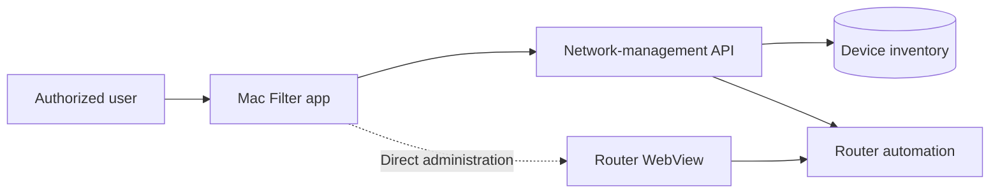
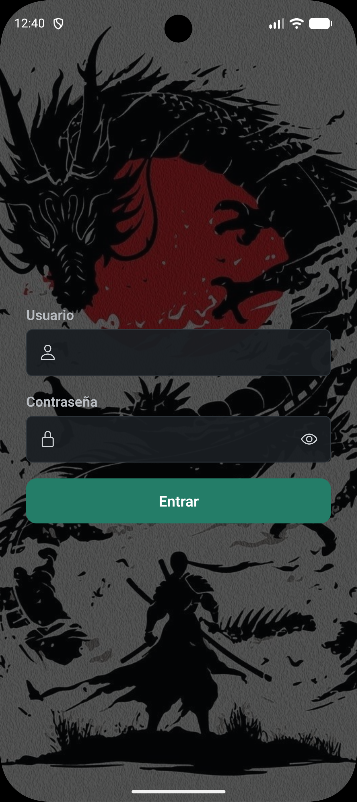
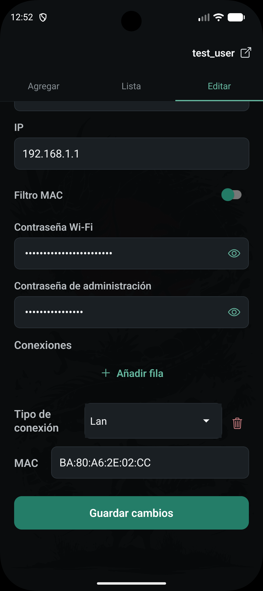
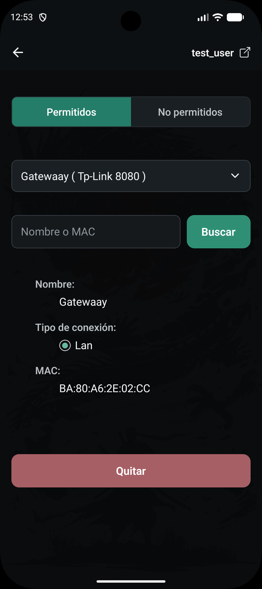
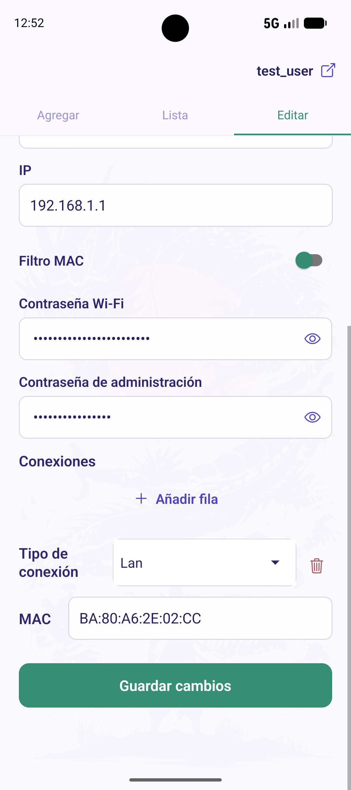
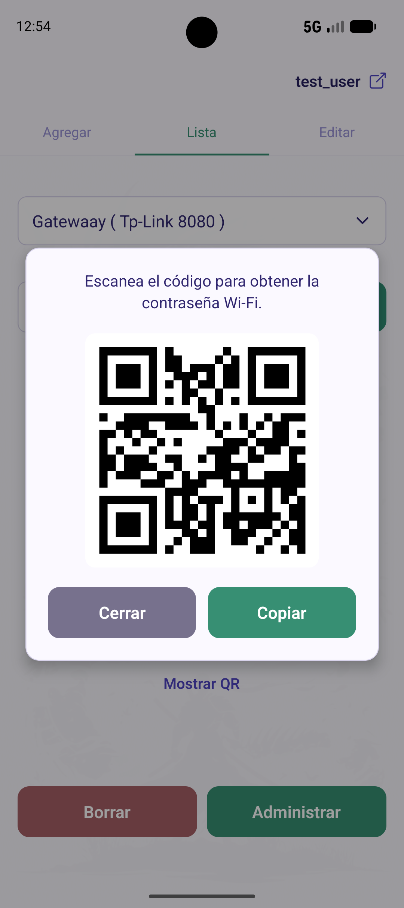
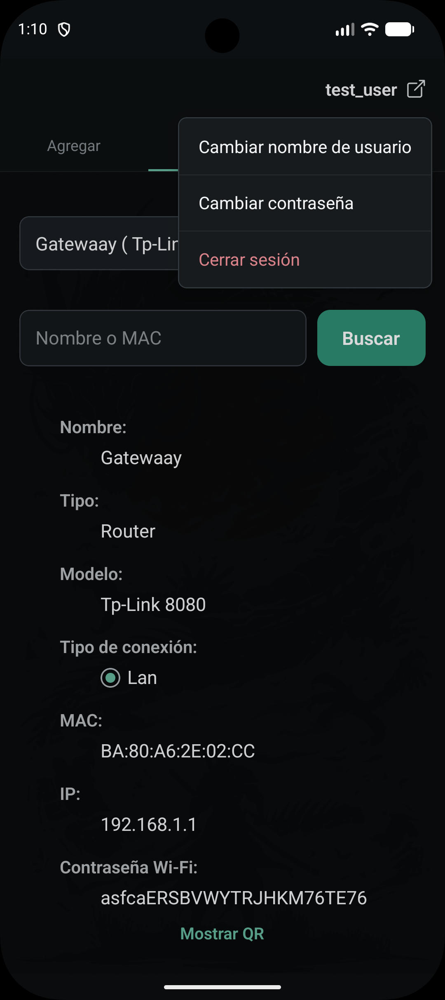
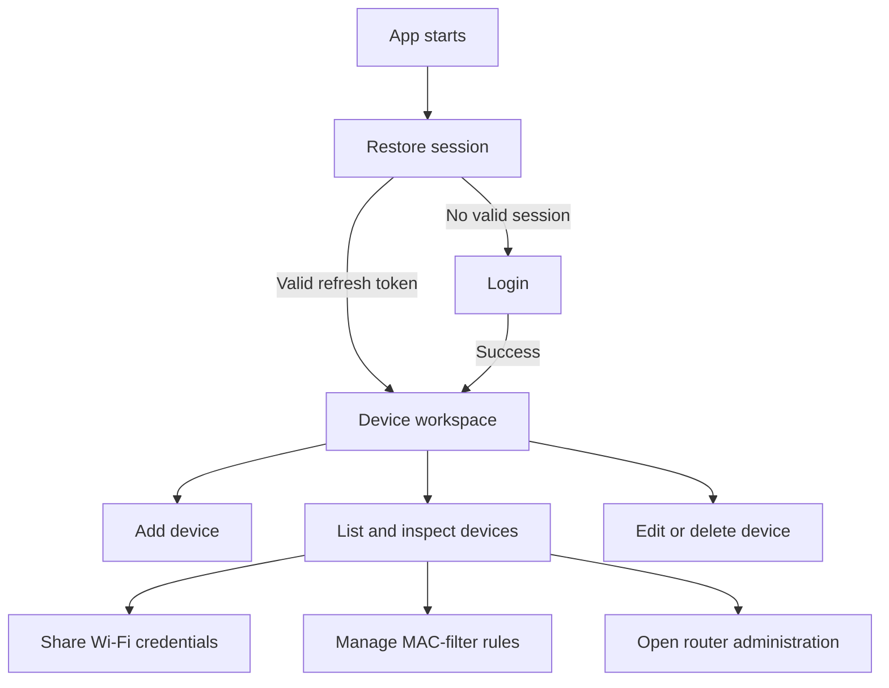
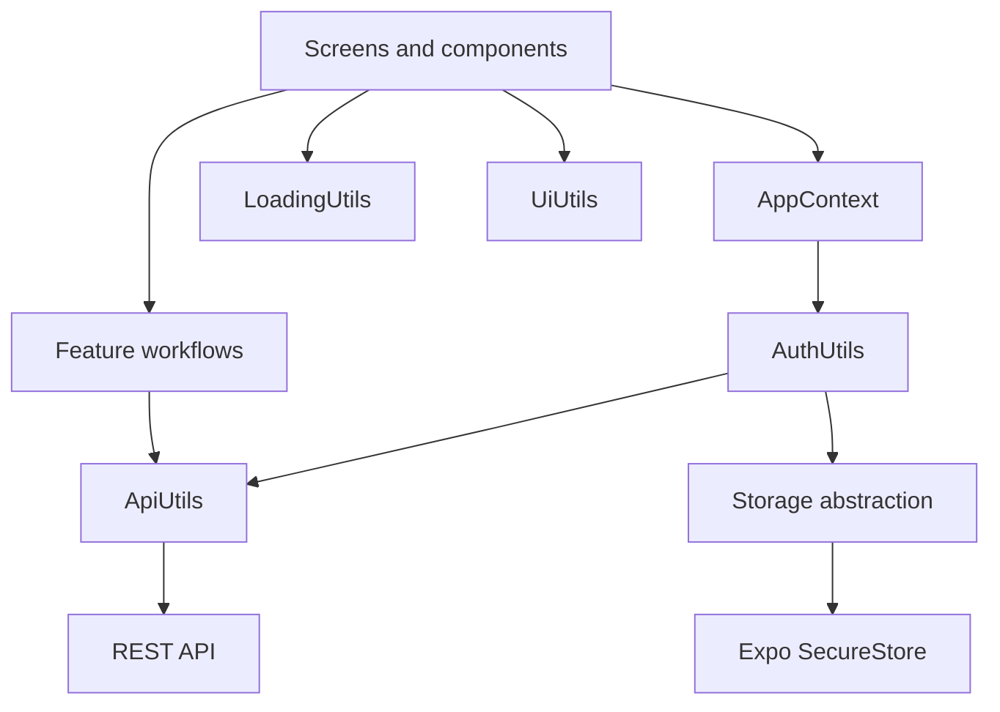
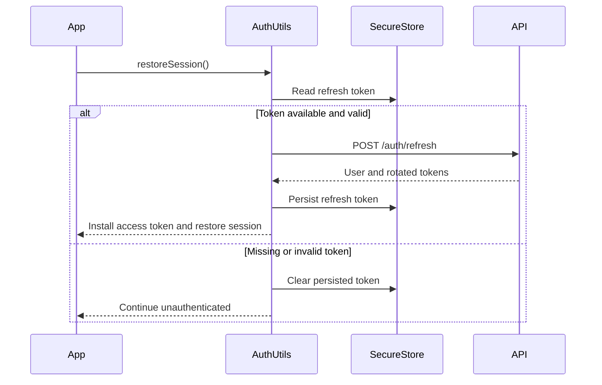

# Mac Filter

[](https://expo.dev/)
[](https://reactnative.dev/)
[](https://www.typescriptlang.org/)
[](https://pnpm.io/)
[](LICENSE)

Mac Filter is a React Native application built with Expo for managing network devices and router MAC-filter rules from a mobile device.

It acts as the client for a broader network-management system: the app communicates with a REST API that stores the device inventory and applies supported changes to the routers. When direct access is needed, the app can also open a router's administration interface in an authenticated WebView.



## Why this project?

Managing new devices used to mean adding their MAC addresses to the routers manually. That made the developer's family dependent on him whenever a device needed access and left the device inventory scattered across notes.

Mac Filter turns that manual process into a shared, repeatable workflow. The database provides a central inventory of devices and their connections, the API automates supported router operations, and the mobile app gives authorized family members a practical way to manage access without waiting for the developer. It also makes the same administration work faster and more reliable for the developer himself.

## Features

| Area | Capabilities |
| --- | --- |
| Authentication | JWT authentication, refresh-token session restoration and secure token storage with Expo SecureStore |
| Device inventory | Create, list, update and delete network devices with one or more interfaces |
| Router management | Store router details, open its administration interface and manage MAC-filter rules |
| MAC filtering | Search devices by name or MAC and move interfaces between allowed and blocked lists |
| Data synchronization | Version-based polling refreshes data only when the server reports a change |
| Wi-Fi sharing | Generate a password QR code locally and copy its value without sending it to a third party |
| Interface | Reusable form controls, responsive layouts, loading states and full light/dark theme support |
| Error handling | Normalized API responses, network feedback and field-level server validation errors |

## Screenshots

<table>
  <tr>
    <td align="center"><strong>Login</strong></td>
    <td align="center"><strong>Edit device</strong></td>
    <td align="center"><strong>MAC Filter</strong></td>
  </tr>
  <tr>
    <td></td>
    <td></td>
    <td></td>
  </tr>
  <tr>
    <td align="center"><strong>Light theme</strong></td>
    <td align="center"><strong>Device list &amp; Wi-Fi QR</strong></td>
    <td align="center"><strong>User menu</strong></td>
  </tr>
  <tr>
    <td></td>
    <td></td>
    <td></td>
  </tr>
</table>

> The screenshots use test data. Do not publish real router credentials, Wi-Fi passwords or private device identifiers.

## Application Flow



The authenticated workspace is organized around three device tabs: add, list and edit. Router administration, Wi-Fi sharing and MAC filtering are contextual actions reached from the selected device, so their behavior does not need to be repeated in a separate screen-by-screen catalogue.

## Architecture

The application separates HTTP transport, session management, persistence and React state so screens remain focused on user interaction.



| Layer | Responsibility |
| --- | --- |
| Screens and components | Render state, collect input and map validation errors to controls |
| AppContext | Hold the authenticated user, loading/authentication state and a stable session manager |
| AuthUtils | Coordinate login, refresh, logout, persistence and the authorization interceptor |
| ApiUtils | Encapsulate Axios and normalize successful responses, API errors and network failures |
| Storage | Hide persistence details behind a small interface implemented with SecureStore |
| LoadingUtils | Wrap asynchronous work and guarantee that loading state is reset |
| UiUtils | Present general feedback and visual transformations |

The API remains the authority for permissions, security and business rules. The app maps server validation errors to the relevant fields instead of duplicating backend rules in the client.

### Session lifecycle



Only the refresh token is persisted. The access token belongs to the active session and is attached through a single Axios interceptor, which is replaced after authentication and removed when the session is cleared.

## Tech Stack

- React Native and Expo
- Expo Router and React Navigation
- TypeScript
- Axios
- React Hook Form
- Expo SecureStore
- pnpm
- Jest

## Installation

### Prerequisites

- Node.js
- pnpm
- An Android/iOS device or emulator supported by Expo
- A running compatible backend API

### Setup

```bash
git clone <repository-url>
cd mac-filter
pnpm install
pnpm start
```

Configure the API URL in `.env`:

```env
EXPO_PUBLIC_API_URL=http://<api-host>:<port>
```

The API must be reachable from the device running the application. Avoid committing real local addresses, credentials or tokens.

## Project Structure

```text
src/
├── app/
│   ├── _layout.tsx
│   ├── index.tsx
│   ├── access-router.tsx
│   ├── mac-filter.tsx
│   └── tab-nav-screens/
│       ├── _layout.tsx
│       ├── add.tsx
│       ├── index.tsx
│       └── edit.tsx
├── components/
├── styles/
│   ├── app/
│   ├── components/
│   └── tab-nav-screens/
├── types/
└── utils/
    ├── storage/
    │   ├── storage.ts
    │   └── secure-store-utils.ts
    ├── api-utils.ts
    ├── auth-utils.ts
    ├── loading-utils.ts
    └── ui-utils.ts
```

Route files live under `app`, reusable visual building blocks under `components`, and styles mirror the application areas they belong to. Shared infrastructure is grouped by responsibility instead of being mixed into screens or split into speculative layers.

## Key Decisions

- **Normalized API contract:** consumers work with a discriminated `ApiResponse<T>` instead of Axios-specific response and error types.
- **Centralized session ownership:** `AuthUtils` owns token persistence, interceptor replacement and authentication state transitions.
- **Secure persistence:** refresh tokens are stored through a generic storage interface backed by Expo SecureStore.
- **Backend-led validation:** server errors are mapped to form fields while definitive validation and business rules remain in the API.
- **Version-based polling:** the app checks lightweight version data before refreshing full resources.
- **Local QR generation:** Wi-Fi credentials are encoded on-device and are not sent to an external QR service.
- **Direct router access:** a WebView is available for operations that are not automated by the API.

## Design Principles

- Keep components focused on presentation and user interaction.
- Reuse controls and workflows where they are genuinely shared.
- Keep feature-specific composition close to its consumer.
- Prefer explicit responsibilities over premature abstraction.
- Treat the backend as the source of truth.
- Keep infrastructure replaceable and straightforward to test.

## License

This project is licensed under the [MIT License](LICENSE).
